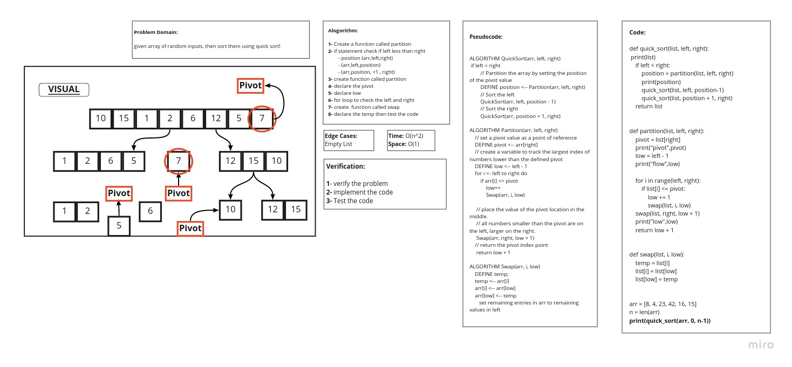

# Challenge Summary

**Given array have random input, then sorted it using Quick Sort.**

## Whiteboard Process



## Approach & Efficiency

> What approach did you take ? 
**Algorithm**

> Why ? 
**Because it is Quick Sort**

> What is the Big O space/time for this approach ?
**Time: O(n^2) : Because : The basic operation of this algorithm is comparison. This will happen n * (n-1) number of times…concluding the algorithm to be n squared.**

**Space: O(1) : Because : No need to additional space.**

## Solution
```
def quick_sort(list, left, right):
    print(list)
    if left < right:
        position = partition(list, left, right)
        print(position)
        quick_sort(list, left, position-1)
        quick_sort(list, position + 1, right)
    return list


def partition(list, left, right):
    pivot = list[right]
    print("pivot",pivot)
    low = left - 1
    print("flow",low)

    for i in range(left, right):
        if list[i] <= pivot:
            low += 1
            swap(list, i, low)
    swap(list, right, low + 1)
    print("low",low)
    return low + 1


def swap(list, i, low):
    temp = list[i]
    list[i] = list[low]
    list[low] = temp


arr = [8, 4, 23, 42, 16, 15]
n = len(arr)
print(quick_sort(arr, 0, n-1))

```
 

| Subject     | links |
| ----------- | ----------- |
| quick_sort | [quick_sort.py](quick_sort/quick_sort.py) |
| test_quick_sort | [test_quick_sort.py](tests/test_quick_sort.py) |
| BLOG | [BLOG.md](BLOG.md) |