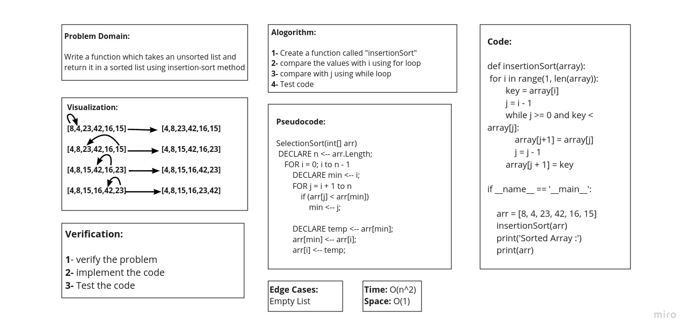

# Challenge Summary

**Given array that take random input and give us Insertion Sort output.**

## Whiteboard Process

## Approach & Efficiency

> What approach did you take ? 
**Algorithm**

> Why ? 
**Because it is Insertion Sort**

> What is the Big O space/time for this approach ?
**Time: O(n^2) : Because : The basic operation of this algorithm is comparison. This will happen n * (n-1) number of times…concluding the algorithm to be n squared.**

**Space: O(1) : Because : No additional space is being created. This array is being sorted in place…keeping the space at constant O(1).**

## Solution

  def insertionSort(array):
    for i in range(1, len(array)):
        key = array[i]
        j = i - 1
        while j >= 0 and key < array[j]:
            array[j+1] = array[j]
            j = j - 1 
        array[j + 1] = key

if __name__ == '__main__':
    
    arr = [8, 4, 23, 42, 16, 15]
    insertionSort(arr)
    print('Sorted Array :')
    print(arr)

| Subject     | links |
| ----------- | ----------- |
| insertion_sort | [insertion_sort](insertion_sort/insertion_sort.py) |
| test_insertion_sort | [tests/test_insertion_sort.py](tests/test_insertion_sort.py) |
| BLOG | [BLOG.md](BLOG.md) |