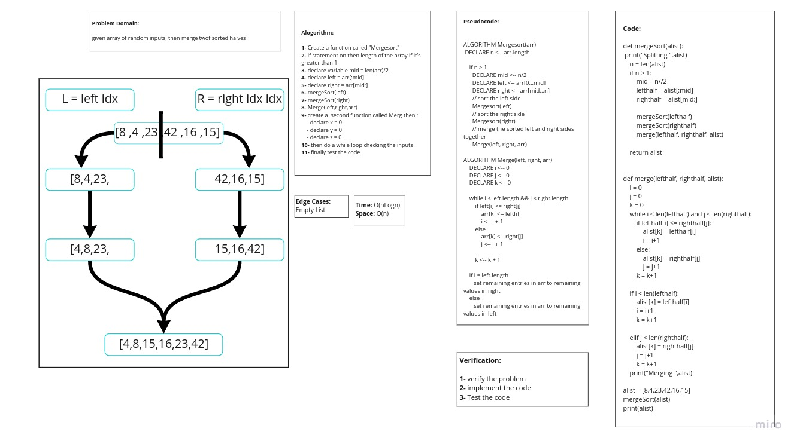

# Challenge Summary

**Given array have random inputs, then merges the two sorted halves.**

## Whiteboard Process



## Approach & Efficiency

### What approach did you take ?

*Algorithm*

### Why? 

*Because it is Merge Sort*

### What is the Big O space/time for this approach? 

*Time : O(nLogn) : Because : merge sort always divides the array into two halves and takes linear time to merge two halves.*

*Space : O(n) : Because : the number of spaces is unknown.*

## Solution
```
def mergeSort(alist):
    print("Splitting ",alist)
    n = len(alist)
    if n > 1:
        mid = n//2
        lefthalf = alist[:mid]
        righthalf = alist[mid:]

        mergeSort(lefthalf)
        mergeSort(righthalf)
        merge(lefthalf, righthalf, alist)

    return alist


def merge(lefthalf, righthalf, alist):
    i = 0
    j = 0
    k = 0
    while i < len(lefthalf) and j < len(righthalf):
        if lefthalf[i] <= righthalf[j]:
            alist[k] = lefthalf[i]
            i = i+1
        else:
            alist[k] = righthalf[j]
            j = j+1
        k = k+1

    if i < len(lefthalf):
        alist[k] = lefthalf[i]
        i = i+1
        k = k+1

    elif j < len(righthalf):
        alist[k] = righthalf[j]
        j = j+1
        k = k+1
    print("Merging ",alist)

alist = [8,4,23,42,16,15]
mergeSort(alist)
print(alist)
```

| Subject     | links |
| ----------- | ----------- |
| merge_sort | [merge_sort.py](merge_sort/merge_sort.py) |
| test_merge_sort | [test_merge_sort.py](tests/test_merge_sort.py) |
| BLOG | [BLOG.md](BLOG.md) |