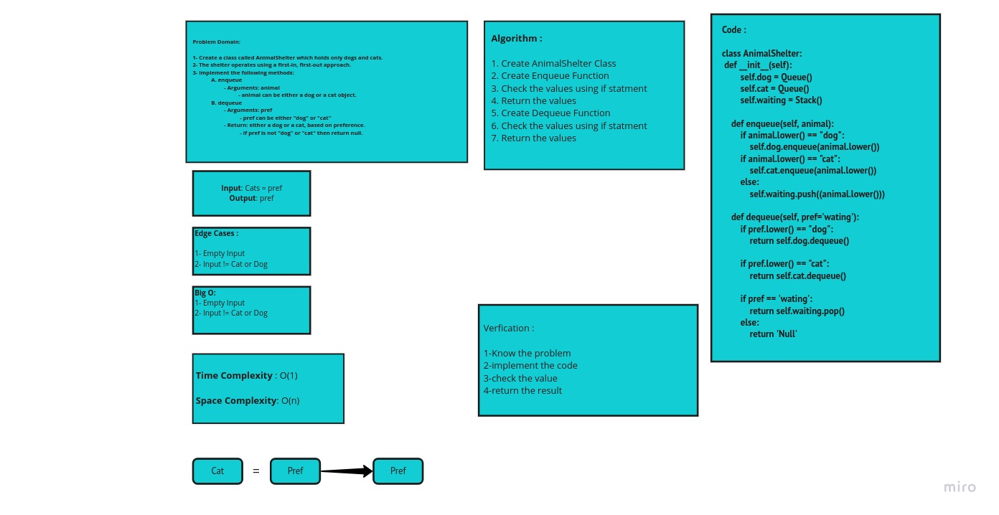

# Challenge Summary

1. Create a class called AnimalShelter which holds only dogs and cats.
2. The shelter operates using a first-in, first-out approach.
3. Implement the following methods:

* enqueue

1. Arguments: animal
2. animal can be either a dog or a cat object.
        
* dequeue

1. Arguments: pref
2. pref can be either "dog" or "cat"
3. Return: either a dog or a cat, based on preference.
4. If pref is not "dog" or "cat" then return null.

## White-Board Process 

## Approach & Efficiency

> What approach did you take ? 
* Algorithm 

> Why ?  
* Because it is stack-and-queue class

> What is the Big O space/time for this approach ? 
**Time : O(1)**

**Space : O(n)**

## Solution

  class AnimalShelter:
    def __init__(self):
        self.dog = Queue()
        self.cat = Queue()
        self.waiting = Stack()

    def enqueue(self,animal):
        if animal.lower() == "dog":
            self.dog.enqueue(animal.lower())
        if animal.lower() == "cat":
            self.cat.enqueue(animal.lower())
        else:
            self.waiting.push((animal.lower()))

    def dequeue(self, pref='wating'):
        if pref.lower() == "dog":
            return self.dog.dequeue()

        if pref.lower() == "cat":
            return self.cat.dequeue()

        if pref == 'wating':
            return self.waiting.pop()
        else:
            return 'Null'

      

| Subject     | links |
| ----------- | ----------- |
| stack-queue-animal-shelter | [stack_queue_animal_shelter](stack_and_queue/animal_shelter.py) |
| test_stack_queue_animal_shelter | [test_stack_queue_animal_shelter](tests/test_animal_shelter.py) |
