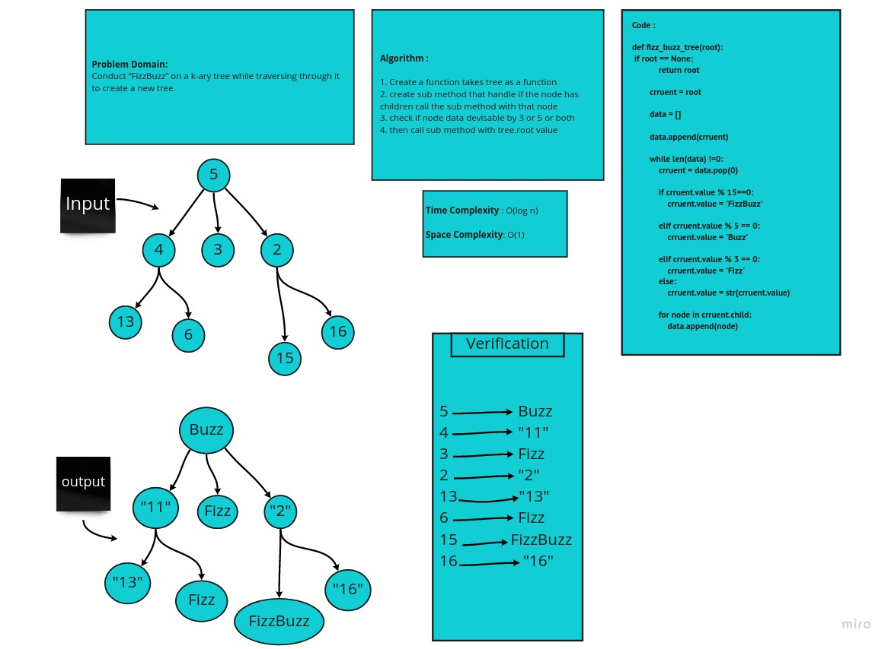

# Trees


* 1- K-ary Trees :

*If Nodes are able have more than 2 child nodes, we call the tree that contains them a K-ary Tree. In this type of tree we use K to refer to the maximum number of children that each Node is able to have.* 


* 2- Binary Search Trees :

*A Binary Search Tree (BST) is a type of tree that does have some structure attached to it. In a BST, nodes are organized in a manner where all values that are smaller than the root are placed to the left, and all values that are larger than the root are placed to the right.* 

* Traversals :

***An important aspect of trees is how to traverse them. Traversing a tree allows us to search for a node, print out the contents of a tree, and much more! There are two categories of traversals when it comes to trees:***

- 1- Depth First :

*Depth first traversal is where we prioritize going through the depth (height) of the tree first. There are multiple ways to carry out depth first traversal, and each method changes the order in which we search/print the root. Here are three methods for depth first traversal:*

* Pre-order: root >> left >> right

* In-order: left >> root >> right

* Post-order: left >> right >> root

 
* 2- Breadth First :

*Breadth first traversal iterates through the tree by going through each level of the tree node-by-node.*

### Feature Tasks

* Write a function called fizz buzz tree
* Arguments: k-ary tree
* Return: new k-ary tree

**Determine whether or not the value of each node is divisible by 3, 5 or both. Create a new tree with the same structure as the original, but the values modified as follows:**

* If the value is divisible by 3, replace the value with “Fizz”
* If the value is divisible by 5, replace the value with “Buzz”
* If the value is divisible by 3 and 5, replace the value with “FizzBuzz”
* If the value is not divisible by 3 or 5, simply turn the number into a String.

## Whiteboard Process



## Approach & Efficiency

> What approach did you take ?
**Algorithm**

> Why ? 
**Because it is fizz buzz tree** 

> What is the Big O space/time for this approach ?
**Time : O(n) Because : n is the number of nodes in the tree**

**Space : O(n) Because : spaces number unknown**

## Solution
```
class Node_2:
    def __init__(self,value=''):
        self.value = value
        self.child = []


def fizz_buzz_tree(root):
        if root == None:
            return root
        
        crruent = root

        data = []

        data.append(crruent)

        while len(data) !=0:
            crruent = data.pop(0)

            if crruent.value % 15==0:
                crruent.value = 'FizzBuzz'

            elif crruent.value % 5 == 0:
                crruent.value = 'Buzz'

            elif crruent.value % 3 == 0:
                crruent.value = 'Fizz'
            else:
                crruent.value = str(crruent.value)

            for node in crruent.child:
                data.append(node)

        return root

```

| Subject     | links |
| ----------- | ----------- |
| tree_fizz_buzz | [tree_fizz_buzz](trees/trees.py) |
| test_tree_fizz_buzz | [test_tree_fizz_buzz](tests/test_trees.py) |

