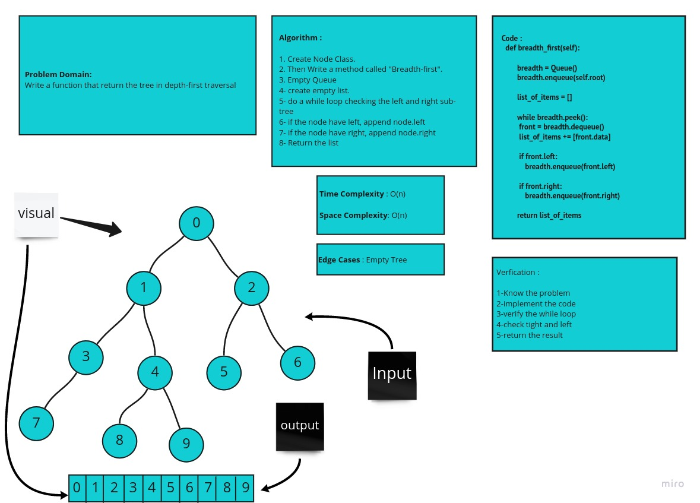

# Trees


* 1- K-ary Trees :

*If Nodes are able have more than 2 child nodes, we call the tree that contains them a K-ary Tree. In this type of tree we use K to refer to the maximum number of children that each Node is able to have.* 


* 2- Binary Search Trees :

*A Binary Search Tree (BST) is a type of tree that does have some structure attached to it. In a BST, nodes are organized in a manner where all values that are smaller than the root are placed to the left, and all values that are larger than the root are placed to the right.* 

* Traversals :

***An important aspect of trees is how to traverse them. Traversing a tree allows us to search for a node, print out the contents of a tree, and much more! There are two categories of traversals when it comes to trees:***

- 1- Depth First :

*Depth first traversal is where we prioritize going through the depth (height) of the tree first. There are multiple ways to carry out depth first traversal, and each method changes the order in which we search/print the root. Here are three methods for depth first traversal:*

* Pre-order: root >> left >> right

* In-order: left >> root >> right

* Post-order: left >> right >> root

 
* 2- Breadth First :

*Breadth first traversal iterates through the tree by going through each level of the tree node-by-node.*

### Feature Tasks

* Write a function called breadth first
* Arguments: tree
* Return: list of all values in the tree, in the order they were encountered


## Whiteboard Process



## Approach & Efficiency

> What approach did you take ?

**Breadth-first approach**

> Why ? 
**Because it is Breadth-first tree**
 
> What is the Big O space/time for this approach ?
**Time : O(n) Because : n is the number of nodes in the binary tree**

**Space : O(n) Because : n is the number of nodes in the binary tree**

## Solution
```
 def breadth_first(self):
       
        breadth = Queue()
        breadth.enqueue(self.root)

        list_of_items = []

        while breadth.peek():
         front = breadth.dequeue()
         list_of_items += [front.data]

         if front.left:
            breadth.enqueue(front.left)

         if front.right:
            breadth.enqueue(front.right)

        return list_of_items

```

| Subject     | links |
| ----------- | ----------- |
| tree_breadth_first | [tree_breadth_first](trees/trees.py) |
| test_tree_breadth_first | [test_tree_breadth_first](tests/test_trees.py) |